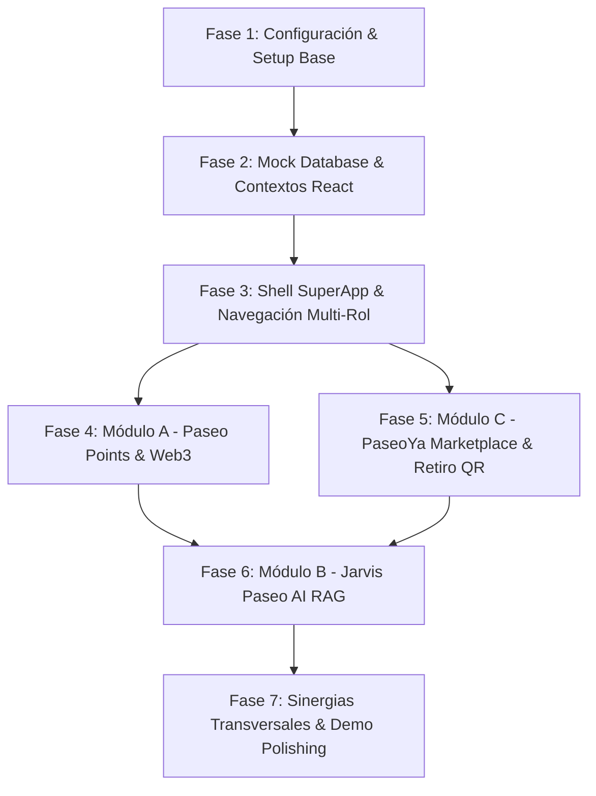

# SUPERAPP ECO SISTEMA PASEO ARANJUEZ
> **Documento Maestro de Contexto y Especificación Técnica para Agentes de IA y Desarrolladores**  
> **Versión:** 1.0 (Hackathon MVP Edition)  
> **Target:** Monorepo / Single Page SuperApp (React 18 + Vite + Tailwind CSS + Ethers.js + AI API)

---

## 1. VISIÓN EJECUTIVA Y PROPÓSITO DEL PROYECTO

El proyecto **SuperApp Ecosistema Paseo Aranjuez** unifica los 3 retos corporativos del centro comercial **Paseo Aranjuez** (Cochabamba, Bolivia) en una única plataforma digital fluida e interconectada:

```
                          ┌─────────────────────────────────────┐
                          │     SUPERAPP PASEO ARANJUEZ         │
                          │   (Shell Unificado / Multi-Rol)     │
                          └──────────────────┬──────────────────┘
                                             │
             ┌───────────────────────────────┼───────────────────────────────┐
             │                               │                               │
             ▼                               ▼                               ▼
   [MÓDULO A: FIDELIDAD]           [MÓDULO B: ASISTENTE]           [MÓDULO C: MARKETPLACE]
       Paseo Points                    Jarvis Paseo                       PaseoYa
  - Tokens ERC-20 (Polygon)       - LLM Context-Aware (RAG)       - Catálogo & Carrito
  - QR Cliente / Scanner          - Búsqueda en Lenguaje Natural  - Retiro Presencial Obligatorio
  - Minting por Compras           - Recomienda Productos PaseoYa  - Ticket QR / PIN de Canje
  - Canje de Recompensas          - Sinergia Transversal          - Dispara Puntos al Completar
             │                               ▲                               │
             │                               │                               │
             └───────────────────────────────┴───────────────────────────────┘
                                  Sinergia Transversal
```

### Reglas de Oro del Hackathon
1. **Unificación (No silos):** No son 3 aplicaciones separadas. Es una SuperApp con una barra de navegación común, un perfil único de usuario y un estado global sincronizado.
2. **Web3 Invisible:** La experiencia Web3 (tokens, balances, transferencias) debe sentirse como una app Web2 moderna. Si el usuario no tiene MetaMask, se provee o simula una *Embedded Wallet / Relayer* transparente.
3. **Retiro Presencial Obligatorio (PaseoYa):** PaseoYa **no** es delivery a domicilio; está diseñado para llevar tráfico físico a los pasillos del centro comercial. Cada pedido genera un PIN/QR para validar en tienda.
4. **Resiliencia Offline/Mock:** Si no hay conexión a APIs externas (OpenAI/Gemini o Polygon RPC), el sistema debe degradarse elegantemente usando datos mockeados y simulación de transacciones locales sin romper la UI.

---

## 2. STACK TECNOLÓGICO Y ARQUITECTURA

| Capa | Tecnología | Justificación Hackathon |
| :--- | :--- | :--- |
| **Frontend Framework** | **React 18+ (Vite) + TypeScript** | Velocidad de desarrollo, tipado estricto y bundling instantáneo. |
| **Estilos & UI** | **Tailwind CSS + Lucide React** | Diseño moderno, responsivo (Mobile-First) y componentes modulares. |
| **Estado Global & Persistencia** | **React Context API + `localStorage`** | Cero latencia, persistencia automática entre recargas, sin configurar DBs pesadas. |
| **Web3 / Blockchain (Reto 1)** | **Ethers.js v6 / Viem + Polygon Amoy Testnet** | Contrato ERC-20 `PaseoToken`. Costos nulos de gas en testnet y compatibilidad EVM estándar. |
| **Inteligencia Artificial (Reto 2)**| **Gemini 1.5 / OpenAI GPT-4o + System Prompt RAG** | Inyección del JSON de tiendas y productos directamente en el prompt del LLM. |
| **Generación y Lectura de QR** | **`qrcode.react` + `html5-qrcode`** | Generación instantánea de tickets QR y escaneo mediante cámara web/móvil. |

---

## 3. ESTRUCTURA DE DIRECTORIOS RECOMENDADA

```
PaseoAranjuez/
├── public/
│   ├── favicon.ico
│   └── mockData.json             # Respaldo inicial de datos
├── src/
│   ├── assets/                   # Logos, banners e imágenes de locales
│   ├── components/
│   │   ├── common/               # Botones, Modales, QRModal, ScannerModal, Badges
│   │   ├── layout/               # Header, BottomNav (Mobile), Sidebar (Desktop)
│   │   └── web3/                 # WalletBadge, GaslessTxIndicator
│   ├── context/
│   │   ├── AppContext.tsx        # Estado global (Usuarios, Tiendas, Productos, Pedidos)
│   │   └── Web3Context.tsx       # Conexión Polygon, contratos, balances y minting
│   ├── data/
│   │   └── initialData.ts        # Semilla tipada basada en mockData.json
│   ├── modules/
│   │   ├── points/               # [Reto 1] Paseo Points (Vistas Cliente, Comercio, Admin)
│   │   │   ├── ClientPointsView.tsx
│   │   │   ├── MerchantScannerView.tsx
│   │   │   └── RewardsCatalog.tsx
│   │   ├── jarvis/               # [Reto 2] Jarvis Paseo (Chatbot IA RAG)
│   │   │   ├── JarvisChat.tsx
│   │   │   ├── JarvisBubble.tsx
│   │   │   └── aiService.ts
│   │   └── paseoya/              # [Reto 3] Marketplace Retiro Presencial
│   │       ├── MarketplaceView.tsx
│   │       ├── ProductDetailModal.tsx
│   │       ├── CartDrawer.tsx
│   │       └── PickupOrderView.tsx
│   ├── contracts/                # Smart Contracts Solidity & ABIs
│   │   ├── PaseoToken.sol
│   │   └── PaseoTokenABI.json
│   ├── types/
│   │   └── index.ts              # Interfaces TypeScript compartidas
│   ├── App.tsx                   # Ruteo/Switch de Vistas SuperApp
│   ├── main.tsx
│   └── index.css                 # Configuración Tailwind
├── AGENT_CONTEXT.md              # Este documento de especificación
├── package.json
├── tailwind.config.js
└── vite.config.ts
```

---

## 4. MODELO DE DATOS Y TIPOS TYPESCRIPT (`src/types/index.ts`)

```typescript
export type UserRole = 'client' | 'merchant' | 'admin';

export interface User {
  id: string;
  name: string;
  qrCode: string;
  walletAddress: string;
  pointsBalance: number;
  role: UserRole;
  storeId?: string; // Solo si es comerciante
}

export interface Store {
  id: string;
  name: string;
  category: 'Tecnología' | 'Gastronomía' | 'Moda' | 'Entretenimiento' | 'Servicios';
  floor: number; // 0: PB, 1: Nivel 1, 2: Nivel 2
  locationDetail: string; // ej. "Local 104, frente a ascensores"
  ownerId: string;
  bannerUrl?: string;
  logoUrl?: string;
  schedule: string;
}

export interface Product {
  id: string;
  storeId: string;
  name: string;
  description: string;
  price: number; // En Bolivianos (Bs.)
  pointsReward: number; // Puntos otorgados por compra
  stock: number;
  imageUrl?: string;
  category: string;
}

export interface Reward {
  id: string;
  costInPoints: number;
  title: string;
  description: string;
  storeId?: string; // Tienda que ofrece el beneficio o "Paseo Aranjuez" general
  validUntil: string;
  stock: number;
}

export type OrderStatus = 'Pendiente' | 'Listo para recoger' | 'Entregado' | 'Cancelado';

export interface Order {
  orderId: string;
  userId: string;
  userName: string;
  storeId: string;
  storeName: string;
  items: {
    productId: string;
    productName: string;
    quantity: number;
    price: number;
  }[];
  totalPrice: number;
  pointsToEarn: number;
  status: OrderStatus;
  pickupPin: string; // PIN numérico de 4 dígitos para retiro
  pickupQrCode: string; // "ORDER-ORD-100-PIN-8452"
  createdAt: string;
}

export interface AppState {
  users: User[];
  currentUser: User;
  stores: Store[];
  products: Product[];
  rewardsCatalog: Reward[];
  orders: Order[];
}
```

---

## 5. ESPECIFICACIÓN DETALLADA DE MÓDULOS

### 5.1. Módulo A: Paseo Points (Reto 1 - Fidelización Web3)
* **Objetivo:** Incentivar la recurrencia y el consumo en el centro comercial mediante tokens fungibles.
* **Tasa de Conversión Base:** **1 Bs. gastado = 1 PaseoPoint (ERC-20)**.
* **Roles y Funcionalidades:**
  1. **Vista Cliente:**
     * Tarjeta digital con su **QR de Fidelidad** personal (`QR-USR-001`).
     * Balance de tokens en tiempo real (leyendo del Smart Contract en Polygon Amoy o sincronizado en estado local).
     * Historial de transacciones (Puntos ganados por compra vs. Puntos quemados por canje).
     * Catálogo de Recompensas con botón de canje inmediato.
  2. **Vista Comercio (Cajero / Validador):**
     * Escáner de QR para registrar compras presenciales.
     * Teclado numérico / Input de monto en Bs.
     * Botón: **"Acreditar Puntos"** $\rightarrow$ Invoca el Relayer / Contrato para acuñar (*mint*) tokens a la wallet del cliente.
     * Escáner de cupones para validar el canje de recompensas.
  3. **Smart Contract (`PaseoToken.sol`):**
     * Estándar ERC-20 con rol `MINTER_ROLE` otorgado a la cuenta del centro comercial (Relayer) para patrocinar transacciones y evitar fricción de gas al cliente.
     * Soporte de quema (*burn*) al canjear recompensas.

### 5.2. Módulo B: Jarvis Paseo (Reto 2 - Asistente Inteligente RAG)
* **Objetivo:** Asistir proactivamente al visitante en lenguaje natural con recomendaciones precisas del centro comercial.
* **Inyección de Contexto (Prompt Engineering RAG):**
  El asistente recibe en su *System Prompt* el JSON activo de tiendas, horarios, pisos y productos de PaseoYa:
  ```markdown
  Eres "Jarvis Paseo", el concierge inteligente y amigable del Centro Comercial Paseo Aranjuez en Cochabamba, Bolivia.
  
  CONTEXTO ACTUAL DEL PASEO ARANJUEZ:
  - Tiendas y Ubicaciones: {JSON.stringify(stores)}
  - Productos Disponibles para Retiro: {JSON.stringify(products)}
  - Promociones y Recompensas: {JSON.stringify(rewards)}

  DIRECTRICES DE RESPUESTA:
  1. Si el usuario busca algo genérico (ej. "tengo hambre", "busco un regalo para mi novia"), analiza el catálogo y recomienda tiendas y productos específicos indicando el Piso y Local.
  2. Ofrece la opción de apartar el producto directamente en PaseoYa para recogerlo hoy mismo.
  3. Recuerda al cliente que cada compra en PaseoYa acumula PaseoPoints para canjear por premios.
  4. Mantén un tono cálido, moderno, profesional y conciso.
  ```
* **Acciones Interactivas en el Chat:**
  Las respuestas del bot deben poder renderizar tarjetas interactivas de producto con un botón directo: `[Ver en PaseoYa]` o `[Agregar al Carrito]`.

### 5.3. Módulo C: PaseoYa (Reto 3 - Marketplace con Retiro Presencial)
* **Objetivo:** Facilitar la compra rápida y el tráfico físico hacia los locales del centro comercial.
* **Regla Inflexible:** **Retiro Exclusivamente Presencial (Click & Collect)**. No existe despacho a domicilio.
* **Flujo Operativo:**
  1. **Navegación:** Filtro por categorías (Tecnología, Moda, Gastronomía) y por Pisos (PB, Piso 1, Piso 2).
  2. **Carrito de Compra:** Agrupado por tienda o unificado con desglose de recojo en cada local.
  3. **Confirmación de Pedido:**
     * Genera un **PIN numérico seguro** (4 dígitos) y un **Código QR de Retiro**.
     * El pedido entra en estado `Listo para recoger`.
  4. **Retiro Físico en Tienda:**
     * El cliente va al local de Paseo Aranjuez y muestra su QR/PIN.
     * El dependiente del local (usando el rol `merchant`) ingresa el PIN o escanea el QR.
     * El pedido pasa a `Entregado`.
  5. **Disparo Transversal (Sinergia Automática):**
     * En cuanto la orden pasa a `Entregado`, el sistema ejecuta automáticamente `awardPoints(userId, order.pointsToEarn)`.
     * El cliente recibe una notificación en pantalla: *"¡Has recibido X PaseoPoints por tu compra en [Tienda]!"*.

---

## 6. DATOS INICIALES MOCK (`src/data/initialData.ts`)

```json
{
  "users": [
    {
      "id": "USR-001",
      "name": "Joaquín Soria",
      "qrCode": "QR-USR-001",
      "walletAddress": "0x742d35Cc6634C0532925a3b844Bc454e4438f44e",
      "pointsBalance": 500,
      "role": "client"
    },
    {
      "id": "ADM-01",
      "name": "Admin TechStore",
      "qrCode": "QR-ADM-01",
      "walletAddress": "0x1111111111111111111111111111111111111111",
      "pointsBalance": 0,
      "role": "merchant",
      "storeId": "ST-01"
    }
  ],
  "stores": [
    {
      "id": "ST-01",
      "name": "TechStore Aranjuez",
      "category": "Tecnología",
      "floor": 1,
      "locationDetail": "Piso 1, Pasillo Central Local 102",
      "ownerId": "ADM-01",
      "schedule": "10:00 - 21:00"
    },
    {
      "id": "ST-02",
      "name": "Café Central Aranjuez",
      "category": "Gastronomía",
      "floor": 0,
      "locationDetail": "Planta Baja, Entrada Principal",
      "ownerId": "ADM-02",
      "schedule": "08:00 - 22:00"
    },
    {
      "id": "ST-03",
      "name": "Moda & Estilo Cochabamba",
      "category": "Moda",
      "floor": 2,
      "locationDetail": "Piso 2, Junto a Escaleras Mecánicas",
      "ownerId": "ADM-03",
      "schedule": "10:00 - 21:30"
    }
  ],
  "products": [
    {
      "id": "P-01",
      "storeId": "ST-01",
      "name": "Audífonos Bluetooth Noise Cancelling",
      "description": "Batería de 30 hrs, conexión multipunto y estuche de carga rápida.",
      "price": 250,
      "pointsReward": 250,
      "stock": 10,
      "category": "Tecnología"
    },
    {
      "id": "P-02",
      "storeId": "ST-02",
      "name": "Combo Café Espresso + Croissant",
      "description": "Café de especialidad boliviano recién tostado y croissant artesanal de mantequilla.",
      "price": 30,
      "pointsReward": 30,
      "stock": 50,
      "category": "Gastronomía"
    },
    {
      "id": "P-03",
      "storeId": "ST-03",
      "name": "Gorra Urbana Paseo Edition",
      "description": "Gorra ajustable con bordado premium de alta durabilidad.",
      "price": 120,
      "pointsReward": 120,
      "stock": 15,
      "category": "Moda"
    }
  ],
  "rewardsCatalog": [
    {
      "id": "RW-01",
      "costInPoints": 150,
      "title": "Café Americano Gratis",
      "description": "Válido en Café Central Aranjuez. Presenta el cupón en caja.",
      "storeId": "ST-02",
      "validUntil": "2026-12-31",
      "stock": 100
    },
    {
      "id": "RW-02",
      "costInPoints": 300,
      "title": "Bono de Descuento 15% en Tecnología",
      "description": "Aplicable en compras mayores a 200 Bs en TechStore.",
      "storeId": "ST-01",
      "validUntil": "2026-12-31",
      "stock": 50
    },
    {
      "id": "RW-03",
      "costInPoints": 500,
      "title": "Pase de Estacionamiento VIP (2 Horas)",
      "description": "Acceso libre al estacionamiento subterráneo de Paseo Aranjuez.",
      "validUntil": "2026-12-31",
      "stock": 200
    }
  ],
  "orders": [
    {
      "orderId": "ORD-100",
      "userId": "USR-001",
      "userName": "Joaquín Soria",
      "storeId": "ST-01",
      "storeName": "TechStore Aranjuez",
      "items": [
        {
          "productId": "P-01",
          "productName": "Audífonos Bluetooth Noise Cancelling",
          "quantity": 1,
          "price": 250
        }
      ],
      "totalPrice": 250,
      "pointsToEarn": 250,
      "status": "Listo para recoger",
      "pickupPin": "8452",
      "pickupQrCode": "ORDER-ORD-100-PIN-8452",
      "createdAt": "2026-10-03T10:15:00Z"
    }
  ]
}
```

---

## 7. PLAN DE IMPLEMENTACIÓN PASO A PASO PARA EL AGENTE



### Fase 1: Configuración y Setup Base
- Inicializar Vite + React + TypeScript + Tailwind CSS.
- Instalar dependencias esenciales:
  `npm i lucide-react qrcode.react html5-qrcode ethers clsx tailwind-merge`
- Configurar paleta de colores institucional en `tailwind.config.js`:
  - `aranjuez-primary`: Esmeralda elegante / Verde Aranjuez (`#0D5C3A` o `#0F766E`).
  - `aranjuez-gold`: Acentos dorados premium (`#D97706` o `#F59E0B`).
  - `aranjuez-dark`: Modo oscuro moderno (`#0F172A`).

### Fase 2: Contextos React (`AppContext` & `Web3Context`)
- `AppContext`:
  - Cargar estado inicial desde `initialData.ts` sincronizado con `localStorage`.
  - Exponer métodos:
    - `switchRole(role, storeId)`: Alternar entre Cliente, Comercio y Admin rápidamente para demo.
    - `createOrder(cartItems)`: Genera PIN de 4 dígitos, código QR y descuenta stock.
    - `deliverOrder(orderId, pin)`: Valida PIN, cambia estado a `Entregado` y dispara `awardPoints`.
    - `awardPoints(userId, amount)`: Acredita puntos Web3/locales.
    - `redeemReward(rewardId)`: Quema puntos y genera ticket de beneficio.
- `Web3Context`:
  - Conexión a Polygon Amoy (RPC público: `https://rpc-amoy.polygon.technology/`).
  - Lógica de lectura de balance ERC-20 real o emulado según disponibilidad de provider.

### Fase 3: Shell SuperApp y Navegación
- Header superior con selector de rol instantáneo (para que el jurado del Hackathon pruebe modo Cliente y modo Cajero en 1 click) y estado de Wallet/Puntos.
- Barra de navegación inferior (Mobile) y pestañas superiores (Desktop):
  - 🛍️ **PaseoYa** (Marketplace)
  - 💎 **Puntos & QR** (Fidelización)
  - 🤖 **Jarvis** (Asistente IA flotante o pantalla completa)
  - 📦 **Mis Pedidos** (Tickets de recojo con QR)

### Fase 4: Módulo A - Paseo Points
- Tarjeta de fidelidad con degradado premium, balance de PaseoPoints y QR personal.
- Modal de escaneo para comercios (simulable con input de código para laptops sin cámara).
- Catálogo de canje con validación de balance.

### Fase 5: Módulo C - PaseoYa Marketplace
- Grilla de productos con filtros por categoría y piso.
- Drawer de carrito de compra con desglose de puntos que se ganarán al retirar.
- Pantalla de confirmación con el ticket de recojo: PIN de 4 dígitos gigante + Código QR.
- Vista de dependiente de tienda: lista de órdenes pendientes por entregar con botón rápido de validación.

### Fase 6: Módulo B - Jarvis Paseo
- Interfaz de chat con streaming o mensajes instantáneos.
- Sistema de RAG local: lee `AppContext.stores` y `AppContext.products` y los inyecta en el prompt.
- Mock inteligente con reglas si no hay API Key de Gemini/OpenAI configurada en `.env` (respuestas ricas contextuales automáticas).
- Respuestas con botones de acción para abrir directamente productos de PaseoYa.

### Fase 7: Validación de Sinergias (El Momento WOW para el Pitch)
1. **Paso 1:** Preguntar a Jarvis: *"Quiero unos audífonos y luego tomarme un café"*.
2. **Paso 2:** Jarvis sugiere los *Audífonos Bluetooth* en *TechStore (Piso 1)* y el *Combo Café* en *Café Central (PB)* con enlaces a PaseoYa.
3. **Paso 3:** Se añade al carrito y se confirma el pedido presencial en PaseoYa. Se obtiene el PIN/QR.
4. **Paso 4:** Se cambia el rol a "Cajero TechStore", se escanea/ingresa el PIN y se valida la entrega.
5. **Paso 5:** Inmediatamente salta la animación de Paseo Points acreditados en la wallet Web3.
6. **Paso 6:** Se canjea un descuento de estacionamiento usando los puntos recién ganados.

---

## 8. SMART CONTRACT DE REFERENCIA (`PaseoToken.sol`)

```solidity
// SPDX-License-Identifier: MIT
pragma solidity ^0.8.20;

import "@openzeppelin/contracts/token/ERC20/ERC20.sol";
import "@openzeppelin/contracts/access/Ownable.sol";

contract PaseoToken is ERC20, Ownable {
    // Relayer autorizado para minting patrocinado sin gas para el cliente
    mapping(address => bool) public isAuthorizedRelayer;

    event PointsMinted(address indexed to, uint256 amount, string reason);
    event PointsBurned(address indexed from, uint256 amount, string rewardId);

    constructor() ERC20("Paseo Points", "PASEO") Ownable(msg.sender) {
        isAuthorizedRelayer[msg.sender] = true;
    }

    modifier onlyRelayer() {
        require(isAuthorizedRelayer[msg.sender] || owner() == msg.sender, "No autorizado");
        _;
    }

    function setRelayer(address relayer, bool authorized) external onlyOwner {
        isAuthorizedRelayer[relayer] = authorized;
    }

    function awardPoints(address to, uint256 amount, string calldata reason) external onlyRelayer {
        _mint(to, amount * 10 ** decimals());
        emit PointsMinted(to, amount, reason);
    }

    function redeemReward(address from, uint256 amount, string calldata rewardId) external onlyRelayer {
        _burn(from, amount * 10 ** decimals());
        emit PointsBurned(from, amount, rewardId);
    }
}
```

---

## 9. VARIABLES DE ENTORNO SUGERIDAS (`.env.example`)

```env
# Configuración de IA (Opcional - con fallback automático a mock inteligente)
VITE_GEMINI_API_KEY=
VITE_OPENAI_API_KEY=

# Configuración Web3 Polygon Amoy Testnet
VITE_POLYGON_AMOY_RPC=https://rpc-amoy.polygon.technology/
VITE_PASEO_TOKEN_ADDRESS=0x0000000000000000000000000000000000000000
VITE_RELAYER_PRIVATE_KEY=
```

---

## 10. RECOMENDACIONES DE PRESENTACIÓN (PITCH & DEMO)
- **Modo Demo Switcher:** Mantener siempre visible un mini-panel flotante en la esquina inferior que permita alternar con 1 clic:
  - 👤 Cliente (Joaquín Soria)
  - 🏪 Cajero (TechStore)
  - ☕ Cajero (Café Central)
  - ⚡ Resetear datos de prueba
- **Visual Feedback:** Cada vez que se ganan puntos, mostrar confeti o toast sonoro/animado con el saldo Polygon Amoy actualizado.
- **Storytelling:** El usuario entra al mall, Jarvis lo guía, compra por PaseoYa para retirar al pasar por el local, gana puntos Web3 transparentemente y canjea su estacionamiento. Todo en menos de 2 minutos de demo.
