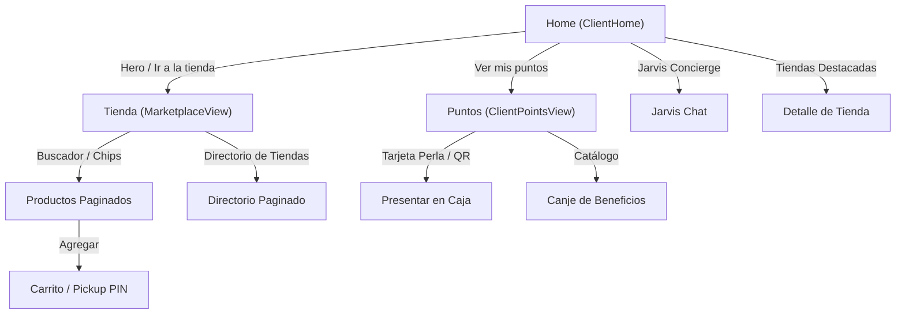

# Paseo Aranjuez SuperApp — Architecture & System Workflow

This document describes the high-level architecture, design system, and end-to-end user workflows of the **Paseo Aranjuez SuperApp**.

---

## 1. Design System & Visual Architecture

### 1.1 Palette & Aesthetic Foundations
- **Base Canvas**: Deep Midnight Indigo (`#07012F` / `248 95% 9%`), creating an immersive, focused backdrop.
- **Monochromatic Accents**: Replaced legacy green with crisp, high-contrast pure white (`--primary: 0 0% 100%`) for buttons, active tabs, and primary controls.
- **Ambient Brand Watermark**: A single, monumental (920px), ultra-subtle (15% opacity) brand icon fixed in the background of `App.tsx` (`pointer-events-none`), maintaining strong identity without peripheral clutter.
- **Pearlescent Loyalty Finish**: The PaseoPoints card uses a satin bone-white/ivory gradient (`#FAF8F5` to `#E9E4DC`) with deep navy typography (`#07012F`) for a tactile physical VIP card aesthetic.

### 1.2 Component Hierarchy (Atomic Design with shadcn)
All components follow Radix UI + Tailwind CSS conventions:
- **Primitives (`src/components/ui/`)**:
  - `Card`, `CardHeader`, `CardTitle`, `CardDescription`, `CardContent`, `CardFooter`: Standardized bounding boxes with consistent padding, elevation, and borders.
  - `Button`: Clean pill and rounded styles with `default`, `secondary`, `outline`, `ghost`, and `link` variants.
  - `Badge`: Semantic indicators with `default`, `secondary`, `outline`, and `subtle` styles.
  - `Input`: Accessible input fields with focus rings and search clearing triggers.
  - `Pagination`: Modular pagination bar with Previous, Next, and numbered page items.

---

## 2. End-to-End User Workflows



### 2.1 Workflow A: Discovery & Ambient Home (`ClientHome`)
1. **Pending Order Alert**: If an active order is ready for pickup, a compact banner highlights the store name, floor, and PIN code with an action to view the ticket.
2. **Ambient Hero**: Hero banner framing the real building photograph (`opacity-55`) blended seamlessly into `#07012F`, providing immediate calls to action: *Ir a la tienda* and *Ver mis puntos*.
3. **Core Pillars**: Two clean cards highlight **PaseoPoints** (live point balance) and **Jarvis Concierge** (AI prompt launcher), removing obsolete duplicates.
4. **Interactive Auto-Carousel**: Features top stores with automatic rotation (3.5s interval). Automatically pauses on hover (`onMouseEnter`) and touch (`onTouchStart`) to prevent moving away during reading or clicking, alongside manual `ChevronLeft`/`ChevronRight` buttons.

---

### 2.2 Workflow B: Online Shopping & Pickup (`MarketplaceView`)
1. **Search & Store Filtering**: Users can filter products either by entering keywords in the shadcn `Input` search bar or by toggling horizontal store chips (`StoreLogo` + button).
2. **Product Pagination**: Products are presented in a responsive grid (8 items per page). The user navigates pages with the `Pagination` bar, completely eliminating endless vertical scrolling fatigue.
3. **Product Inspection & Add to Cart**: Each product card displays product visual, store tag, floor, price in Bs, and earned PaseoPoints. Clicking adds the item to the persistent cart or opens the `ProductDetailModal`.

---

### 2.3 Workflow C: Mall Directory Exploration
1. **Dedicated Store Search**: Separate search input specifically for discovering locales by name or category.
2. **Multi-level Filtering**:
   - Filter by business category (`Gastronomía`, `Moda`, `Tecnología`, `Joyería`, etc.).
   - Filter by floor level (-1 to 4).
3. **Paginated Grid**: Stores are displayed 8 per page with high-quality photos, floor tags, and category labels. Clicking opens the comprehensive `StoreSheet` with opening hours, location, and social links.

---

### 2.4 Workflow D: Loyalty & Web3 Token Economy (`ClientPointsView`)
1. **Pearl Loyalty Card**: Digital membership card displaying member name, wallet address, and balance. Clicking triggers the full-screen QR code modal for cash register scanning.
2. **On-Chain Balance Sync**: Dual verification via local mock state and Polygon Amoy testnet contract ERC-20 balance.
3. **Rewards Catalog (`RewardsCatalog`)**:
   - Benefits sorted by point cost in a unified `Card` grid.
   - One-click redemption with balance deduction and instant QR coupon generation.
4. **Activity History**: Ledger of points earned (mint) and spent (burn) with direct links to Polygonscan transactions.

---

### 2.5 Workflow E: Jarvis Concierge AI (`JarvisChat`)
1. **Context-Aware Recommendations**: Jarvis has access to store locations, opening hours, active promotions, and mall facilities.
2. **Deep-Linking**: Recommendations generated by Jarvis directly open products in the store or show route directions within the mall.

---

## 3. Technology Stack & Commands

| Layer | Technology |
|---|---|
| Framework | React 18 + Vite |
| Language | TypeScript |
| Styling | Tailwind CSS 3.4 + CSS Custom Properties |
| UI Primitives | shadcn/ui + Radix UI + Lucide Icons |
| Animations | Framer Motion |
| Web3 Integration | Ethers.js v6 (Polygon Amoy Testnet) |
| Runtime / Package Manager | Bun / NPM |

### Development Commands
```bash
# Start local development server
bun run dev

# Run type check and production build
bun run build

# Preview production build
bun run preview
```
